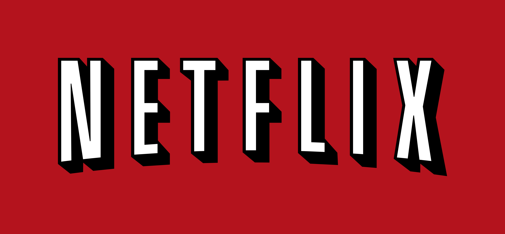
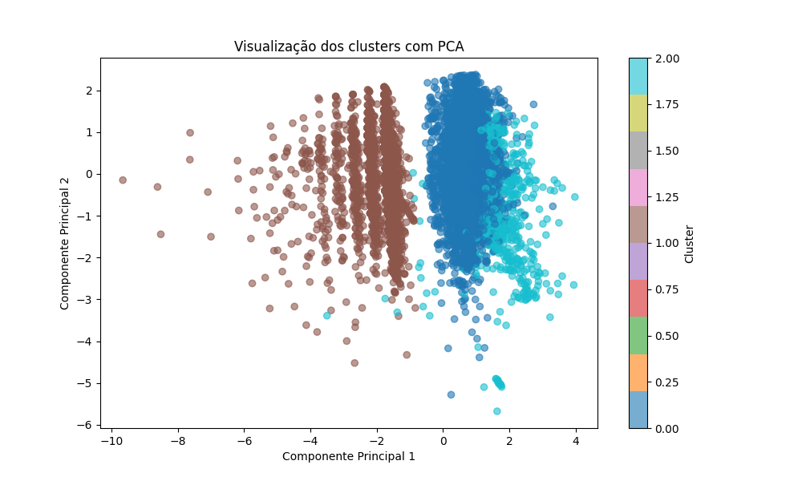

# 🎬 Análise e Clusterização de Títulos da Netflix com KMeans



Este projeto realiza uma análise exploratória e segmentação de títulos da Netflix usando aprendizado não supervisionado com o algoritmo KMeans. O objetivo é identificar padrões no catálogo e criar um sistema simples de recomendação baseado em clusters.

---

## 📂 Sobre o Projeto

- 🔍 Dataset: [Netflix Titles Dataset](https://www.kaggle.com/datasets/shivamb/netflix-shows)
- 📊 Técnicas utilizadas:
  - Pré-processamento de dados com Pandas e Scikit-learn
  - Clusterização com KMeans
  - Redução de dimensionalidade com PCA
  - Avaliação com Silhouette Score, Calinski-Harabasz e Davies-Bouldin
  - Visualização com Matplotlib e Seaborn
  - Interface interativa com Streamlit

---
## Resultados: Utilizei o método do cotovelo e o Silhouette score para garantir o melhor valor de k ou clusters.No caso,retornou o valor de k = 3


Com isso,abaixo é mostrada a imagem com os clusters agrupados de forma precisa.



## 🚀 Funcionalidades

- Limpeza e transformação de dados
- Escolha automática do número ideal de clusters com Silhouette Score
- Visualização dos clusters com PCA
- Sistema de recomendação baseado em agrupamento
- Filtros interativos por cluster no app

---
## Resultados da análise e das métricas utilizadas com KMeans


## 🧠 Como funciona o sistema de recomendação?

1. O usuário escolhe um título que já assistiu
2. O sistema identifica o cluster desse título
3. São recomendados outros títulos do mesmo cluster, com características semelhantes

---

## 🛠️ Como executar o projeto

```bash
git clone https://github.com/seu-usuario/netflix-kmeans.git
cd netflix-kmeans
pip install -r requirements.txt
streamlit run app.py